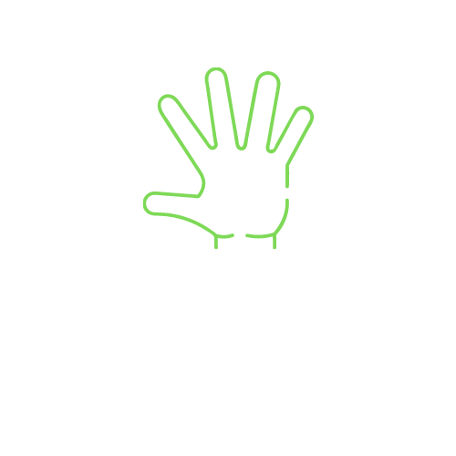

# 2023_HCI_7
# Nap Guardian

## Features

- Detect face on real-time
- Detect face landmark on real-time
- Detect hand on real-time
- Estimate body pose on real-time
- Visualize inference results

| Face Detection | Face Mesh |
| :----: | :----: |
|  |  |

| Hand Detection | Pose Estimation |
| :----: | :----: |
|  |  |

A new Flutter project.
This repository is for Human Computer Interaction Class.

## Getting Started

This project is a starting point for a Flutter application.

A few resources to get you started if this is your first Flutter project:

- [Lab: Write your first Flutter app](https://docs.flutter.dev/get-started/codelab)
- [Cookbook: Useful Flutter samples](https://docs.flutter.dev/cookbook)

For help getting started with Flutter development, view the
[online documentation](https://docs.flutter.dev/), which offers tutorials,
samples, guidance on mobile development, and a full API reference.